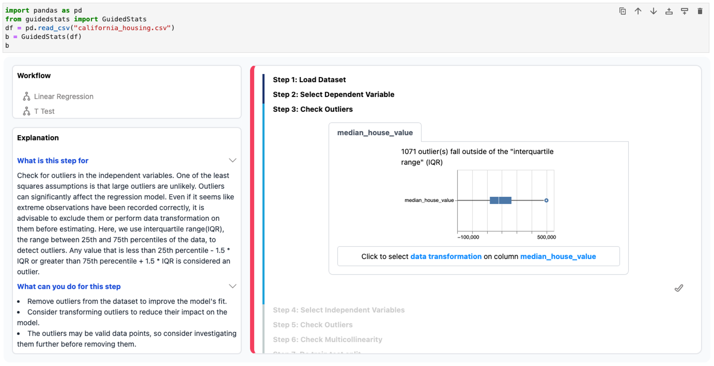

##  GuidedStats 



GuidedStats assists users with statistical analyses through guided workflows. It automatically verifies assumptions and provides actionable suggestions. It is integrated into notebook coding environment, and exchanges dataset, model and results with the coding environment.

**Paper link**: [Guided Statistical Workflows with Interactive Explanations and Assumption Checking](arxiv.org/abs/2410.00365)


## Install (For Developers)

Tips: you can create a new conda environment to avoid any package conflicts.(Currently fixing errors in jupyter notebooks and jupyter lab>=4.0).

```
conda create -n test_env jupyter-packaging python=3.11 "jupyterlab<4.0"
```

First, install the package in editable mode

```
python -m pip install -e .
```

And enable widet frontend

```
# link your development version of the extension with JupyterLab
jupyter labextension develop . --overwrite
```

To build the project

```
npm install
npm run build
```

To automatically rebuild the project after editing frontend code

```
npm run watch
```

To rebuild after editing python package, you need to restart the kernel.

## Install (For Users)

Testing...

## Usage (under construction...)

#### To start with
To initialize the UI, first we need to import `GuidedStats` and load the dataset into a Pandas DataFrame. Then we pass the DataFrame to `GuidedStats`.

```
from guidedstats import GuidedStats
import pandas as pd

df = pd.read_csv("california_housing.csv")
gs = GuidedStats(df)
gs
```

<!-- #### Select workflow

#### Suggested actions

#### Export options

#### Export -->

## Notice
1. Many thanks to **Will Epperson** and **Adam Perer** for their kind assistance in my first HCI paper and my early exploration of research interests.
2. I am currently focused on incorporating more statistical workflows to empirically demonstrate the scalability of our approach, and simplify the code structure as well.
3. As software development is not my primary field of study, I recognize that the code implementation has room for improvement 🙏. I greatly welcome and appreciate any advice or suggestions.

