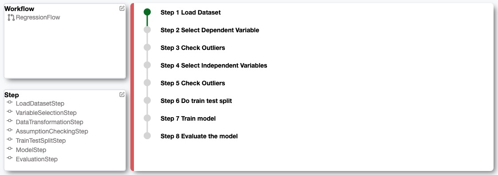

# GuidedStats
A Jupyter extension provides customizable, comparable, and reusable UI to construct guided statistical analysis workflows, for novices in stats and domain experts seeking rigorous guidance.

## Install(For Developers)
Tips: you can create a new conda environment to avoid any package conflicts.

First, install the package in editable mode
```
python -m pip install -e . 
```
And enable widet frontend
```
# link your development version of the extension with JupyterLab
jupyter labextension develop . --overwrite
# for Jupyter Notebook
jupyter nbextension install --sys-prefix --symlink --overwrite --py guidedstats
jupyter nbextension enable --sys-prefix --py guidedstats
```
To build the project
```
npm run build
```
To automatically rebuild the project after editing frontend code
```
npm run watch
```
To rebuild after editing python package, you need to restart the kernel.

## Usage
To initialize the UI, first we need to import `GuidedStats` and load the dataset into a Pandas DataFrame. Then we pass the DataFrame to `GuidedStats`.
```
from guidedstats import GuidedStats
import pandas as pd

df = pd.read_csv("test.csv")
a = GuidedStats(df)
a
```
After that, we can click the desired workflow and start the guidance. 
